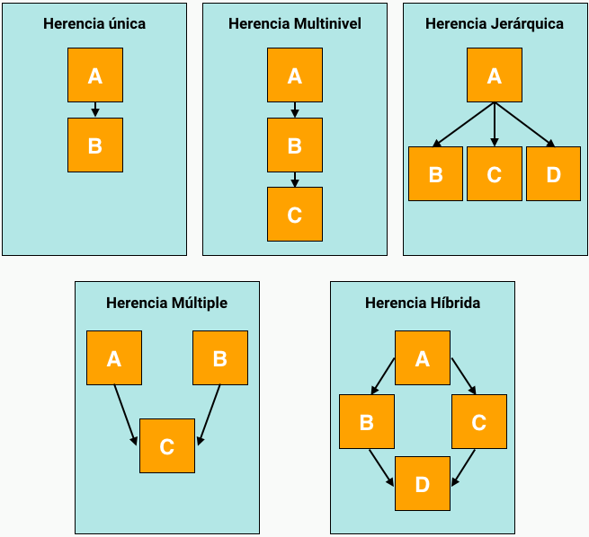

# PardigmaOO
## Paradigma
Definición de Paradigma en el contexto de lenguajes de programación.
Definición de Programación Orientada a Objetos, ¿Cuál fue el primer lenguaje orientado a objetos, quienes y en dónde lo propusieron? 
Define con tus palabras el concepto de abstracción, ¿Por qué se considera fundamental en programación? 
Explica el concepto de encapsulamiento, busca dos imágenes que te ayuden a describir el concepto, una que tenga algún sistema sin encapsulamiento y otra donde sí lo tenga. Menciona porque es importante y qué problemas puede evitar.
Describe con tus palabras el concepto de herencia e ilustra el concepto con imágenes.

## Definicion de Programacion Orientada a Objetas
En programación, se conocen como paradigmas de programación a los métodos usados para realizar determinadas tareas o proyectos. Un paradigma de programación es un modelo básico de diseño y desarrollo de programas, que permite producir programas con unas directrices específicas,

La programación orientada a objetos se basa en el concepto de crear un modelo del problema de destino en sus programas. Creación del primer lenguaje orientado a objetos, SmallTalk por Alan Kay en Xerox PARC.
 
## Definicion abstraccion 
En programación, una abstracción es una manera de reducir la complejidad y permitir un diseño e implementación más eficientes en sistemas de software complejos. Considero que es importante en programacion la abstraccion ya que te permite trabajar de una manera mas eficiente. En programación, una abstracción es una manera de reducir la complejidad y permitir un diseño e implementación más eficientes en sistemas de software complejos. Oculta la dificultad técnica de los sistemas detrás de APIs más simples. La abstracción hace referencia al uso de conceptos o categorías abstractas. El concepto supone asociar una sola respuesta (palabra o acción) a diversos estímulos distinguibles (objetos o acontecimientos). Por ejemplo el concepto perro.
## Definicion encapsulamiento
Encapsulamiento lo entiendo como una forma de juntar datos o métodos. Pienso que es importante el encapsulamiento en programacion ya que te permite guardar datos que vas a utilizar en tu codigo despues. 

## Definicion Herencia
Herencia lo entiendo cómo crear clases clases que se ligan a otras clases

## Uml Diagrama De Clases

El Lenguaje Unificado de Modelado (UML) fue creado para forjar un lenguaje de modelado visual común y semántica y sintácticamente rico para la arquitectura, el diseño y la implementación de sistemas de software complejos, tanto en estructura como en comportamiento. El UML fue creado por los tres desarrolladores James Rumbaugh, Grady Booch e Ivar Jacobson quienes decidieron fusionar varios lenguajes existentes en un estándar común. Los tres ya habían creado sus propios métodos de desarrollo de software orientado a objetos: el método Booch. la técnica de modelado de objetos (OMT). Algunas empresas que usan UML son la OMG. El UML tiene distintas herramientas ya que te permite trabajar de una manera mas visual y tener tus proyectos con una mejor estructura.

